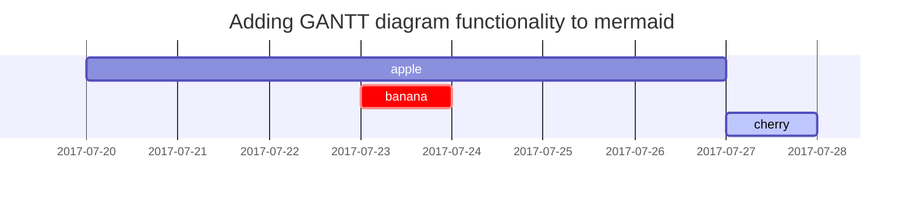

{: .left width="400" height="400"}

Today, we will create a recursive app and learn the logic of recursive algorithms.
The project contains 32 recursive algorithms and is resilient to errors made by the user.

## Project GitHub Link

[Visit the Project on GitHub](https://github.com/MervanKanat/RecursiveApp)

| Priority apples | Second priority | Third priority |
|-------|--------|---------|
| ambrosia | gala | red delicious |
| pink lady | jazz | macintosh |
| honeycrisp | granny smith | fuji |

Bu bir inline matematik örneğidir: $a^2 + b^2 = c^2$.

$$
E = mc^2
$$

## Mathematics

The mathematics powered by [**MathJax**](https://www.mathjax.org/):

$$ \sum_{n=1}^\infty 1/n^2 = \frac{\pi^2}{6} $$

When $a \ne 0$, there are two solutions to $ax^2 + bx + c = 0$ and they are

$$ x = {-b \pm \sqrt{b^2-4ac} \over 2a} $$

## Mermaid SVG

